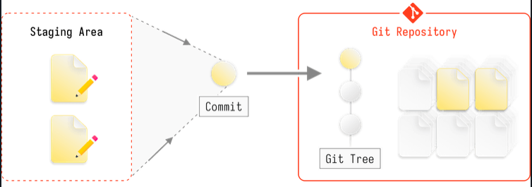

# GIT (Distributed Version Controllder)

Distributed version control systems combine the capabilities of local and remote systems. Developers can store the entire codebase locally, allowing independent work and offline changes. Developers then synchronize their local changes to a central server for other collaborators to consume.

> GitHub is a cloud-based service that hosts Git repositories ( Centralized Platform )

TLDR;

Index/Staging Area: It's like cursor selecting in FileExplorer. Selecting it for next operation



## Install

```sh
# GIT
sudo apt update && sudo apt install git
git --version
# GIT LFS
sudo apt-get install git-lfs
git lfs install
```

## Configure
>
> --global adding config in global space
> --local adding config in local git-space level

```sh
git config --global user.name "Your name"
git config --global user.email "email@domain.com"
git config --global core.editor "code --wait"
git config --global init.defaultbranch main
git config --global log.decorate full
git config --global rerere.enabled false
git config --global advice.forcedeletebranch true

#
git config --add --local webflyx.tone Black
git config --add --local webflyx.status Married
git config --add --local webflyx.status FamilyMan
# unset
git config --unset --local webflyx.tone
# unset-all
git config --unset-all --local webflyx.status
# remove section
git config --remove-section webflyx
```

## Life cycle


## initalize

```sh
git init
touch README.md && git add .
git commit -m 'Initial commit'

git clone <url>
git clone -b --single-branch rbranch <url>   # git branch -a && git checkout <remote-branch>
git clone <url> <dir>   # Clone particular folder in the Repo
git clone --depth=1 <url> # bring only one commit
git clone --mirror <repository-url>  # mirror


# Adding to repo
git remote add origin <url>
git remote -v # details about push/pull
git remote set-url origin  <new-url>   # origin sets upto new url
git push -u <origin/REMOTE-NAME> <local-branch-name>:<remote/origin>      # -u make it upstream
git push -d <branch> # delete the branch
```

There are three commands with similar names: git reset, git restore and git revert.

- `git-revert[1]` is about making a new commit that reverts the changes made by other commits.
- `git-restore[1]` is about restoring files in the working tree from either the index or another commit. This command does not update your branch. The command can also be used to restore files in the index from another commit.
- `git-reset[1]` is about updating your branch, moving the tip in order to add or remove commits from the branch. This operation changes the commit history.
- `git reset` can also be used to restore the index, overlapping with git restore.

```sh
git-restore (1)      - Restore working tree files
git-revert (1)       - Revert some existing commits
git-reset (1)        - Reset current HEAD to the specified state
```

## Restore

Manipulate either Working Area or Staging Area
git-restore (1)      - Restore working tree files

```sh
The following sequence switches to the master branch, reverts the Makefile to two revisions back, deletes hello.c by mistake, and gets it back from the index.

    $ git switch master
    $ git restore --source master~2 Makefile  (1)
    $ rm -f hello.c
    $ git restore hello.c                     (2)

1. take a file out of another commit
2. restore hello.c from the index
```

```sh
git restore --staged file  # you accidentally add file to stage then wanna remove
git restore file # Git will retrieve the state of these file(s) from the HEAD commit, and revert them back to that version
```


## Reset

Reset current HEAD to the specified state

```sh
git reset --hard COMMISH   # clears the mess from the index file and the working tree.
git reset --soft COMMISH   # leaves all your changed files
```

## Log

```sh
git --no-pager log --oneline --decorate --graph --parents --all
git show <commit-hash>  # Examine commit
git show HEAD
```

## update only the latest commit

```sh
git commit --amend -m 'Updated commit message' # update only the message

# Forget file in the commit
git add <file(s)>
git commit --amend --no-edit

# Undo the Last commit
git reset --soft HEAD~1  # --soft option is useful if u want to go back to prev commit, but keep all of your changes. Committed changes will be uncommited and staged, while uncommitted changes will remain staged or unstaged as before.
```

## branching

```sh
git switch <existing-branch>
git switch -c <new-branch>
git branch
git branch -a
git branch -r
git branch -d <branch-name>  # keep git history
git branch -D <branch-name>  # remove git history
```

## Merge

conflict markers

```md
<<<<<<< HEAD
  Changes introduced by the main branch
======
  Changes introduced by the widgets branch
>>>>>>> branch
```

```sh
git merge --abort
git switch <main> && git merge branch # --ff --no-ff --ff-only
git merge --squash/--no-squash    # in the branch do squash and merge
```

## Tag

```sh
git tag # list all tags
git show tag-no.
git tag -a tag-no # with annotated-message
git push --tags  # push only tags
git push origin tag-no # push only that tag
git tag tag-no commit-hash
git tag -d tag-noo
```

## Fetch

```sh
# git push uploads commits from a local repository to a remote repository, while git fetch downloads commits.
git fetch origin main
git switch main
git merge origin/main   # git rebase origin/main


# git pull = git fetch + merge

```

## stash

```sh
git stash -u   # stash untracked file as well   -m ""
git stash show
git stash pop
git stash apply stash@{2}   # git stash pop --index 2
git stash drop stash@{2}
git stash clear # clear all
```

## Rebase

```sh
git rebase <source-branch> <topic-branch>   # play topic commit one-by-one onto source
# remove conflicts
git add/rm file-name
git rebase --continue
git rebase --abort


### Interactive
git rebase -i HEAD~3  # range of HEAD

## Reorder
git rebase -i HEAD~2
# reorder as you need & Be careful when performing this step. Accidentally deleting a commit line will cause Git to destroy the commit.
pick 7f9d4bf Updated README            ->  pick 3f8e810 Accessibility fix
pick 3f8e810 Accessibility fix         ->  pick 7f9d4bf Updated README


## Squash
pick 7f9d4bf E:Accessibility fix for frontpage bug  -> pick 7f9d4bf    E:Accessibility fix for frontpage bug
pick 3f8e810 F:Updated screenreader attributes      -> squash 3f8e810  F:Updated screenreader attributes
pick ec48d74 G:Added comments & updated README      -> squash ec48d74  G:Added comments & updated README

A <- B <- C <- D
               ^-- E={E+F+G}


## Splitting
pick 7f9d4bf E:Accessibility fix for frontpage bug  -> pick 7f9d4bf    E:Accessibility fix for frontpage bug
pick 3f8e810 F:Updated screenreader attributes      -> edit 3f8e810  F:Updated screenreader attributes
pick ec48d74 G:Added comments & updated README      -> squash ec48d74  G:Added comments & updated README

Stopped at 3f8e810...  F:Updated screenreader attributes

git reset HEAD^
# untrack1.cs untrack5.cs untrack4.cs untrack3.cs untrack2.cs
git add untrack1.cs untrack2.cs untrack3.cs untrack4.cs && git commit -m "Added untrack-files"
git add untrack5.cs && git commit -m "Fixed bug untrack-files"

git rebase --continue


## Delete
git rebase -i HEAD~3
# delete it
pick 2f8e823 Refactored screenreader attributes -> pick 2f8e823 Refactored screenreader attributes
pick 7f9d4bf Updated README                     -> drop 7f9d4bf Updated README
pick 3f8e810 Accessibility fix                  -> drop 3f8e810 Accessibility fix

## Reword
git rebase -i HEAD~2
# most recent commit's message use amend
pick 7f9d4bf Frontpag bug fiz    ->     reword 7f9d4bf Frontpag bug fiz
pick 3f8e810 Refactored navbar   ->     pick 3f8e810 Refactored navbar
# Commit message


```

## Reflog

```sh
# git reflog will save so many times??? is it true.
```
